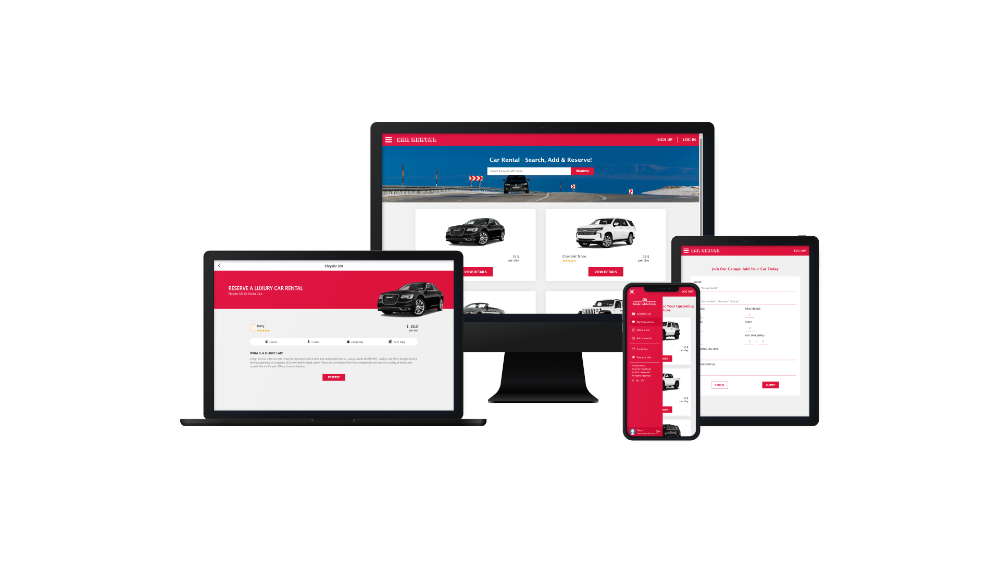

# 📖 [Car Rental App] <a name="about-project"></a>

<div align="center">
  
  <br/>

  <h3><b>Car Rental App</b></h3>

</div>

> The **Car Rental App** is a comprehensive full-stack application where you can seamlessly explore an array of cars, search by name, delve into comprehensive car details, make reservations when logged in, manage reservations, add or delete cars in the database, and personalize your profile with ease. Built with React, Redux as Front-end and Ruby on Rails, PostgreSQL as Back-end API.

- You can see the Back-end repo <a href="https://github.com/xie-xie-x/Car-Rental-back-end">here</a>.

## 🛠 Built With <a name="built-with"></a>

### Tech Stack <a name="tech-stack"></a>
<details>
  <summary>Client</summary>
  <ul>
    <li><a href="https://reactjs.org/">React.js</a></li>
    <li><a href="https://redux.js.org/">Redux</a></li>
  </ul>
</details>

<details>
  <summary>Server</summary>
  <ul>
    <li><a href="https://rubyonrails.org/">Ruby on Rails</a></li>
    <li><a href="https://www.postgresql.org/">PostgreSQL</a></li>
  </ul>
</details>

### Key Features <a name="key-features"></a>

- Car Listings → Users can explore a variety of available cars and utilize a search feature to find specific cars by name.
- Car Details → Users can access comprehensive information about a chosen car and, if logged in, make reservations.
- Reservations → Users can view their reserved cars, with the option to remove them. New users will be directed to sign up or log in.
- Car Deletion → Users can see the cars they've added and delete them from the database. New users will be directed to sign up or log in.
- Car Addition → Users can submit a form to add new cars to the database. New users will be directed to sign up or log in.
- Profile Management → Users can edit their profile picture and username on their profile page.

## 🚀 Live Demo <a name="live-demo"></a>

- Front-end deployed website: [Live Demo](https://car-rental121.netlify.app)

<!-- Kanban Board -->

## 💻 Getting Started <a name="getting-started"></a>

To get a local copy up and running follow these simple example steps.

### Prerequisites

In order to run this project you need:
- Vistual Studio Code
- Browser (Firefox / Google Chrome)
- Node.js (v6.11.2+)
- linters

### Setup

Clone this repository to your desired folder:

```sh
  cd my-folder
  git clone https://github.com/xie-xie-x/Car-Rental-front-end.git
```

## Install

```sh
 npm install --save -dev
```

## Start server

``` npm start ```

## 🔭 Future Features <a name="future-features"></a>

- **[Image_uploading_with_ActiveStorage]**
- **[Token_based_authentication]**

<p align="right">(<a href="#readme-top">back to top</a>)</p>

## ⭐️ Show your support <a name="support"></a>

Give a ⭐️ if you like this project!

## 📝 License <a name="license"></a>

This project is [MIT](./LICENSE) licensed.
